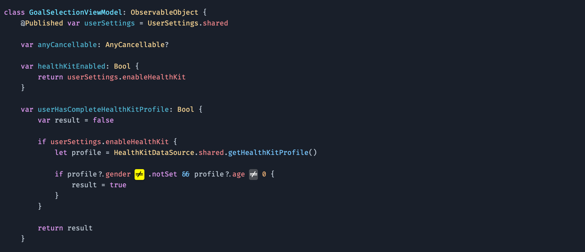

# xcode-theme

🎨 My Xcode theme - Dusky Dark

This repository contains the Xcode theme that I use. Feel free to use it or modify it to your liking.



## Installing manually

You can also choose to do things manually if you want:

1. Clone this repo:
```
$ git clone https://github.com/rynaardb/xcode-theme.git
```

2. Create a folder at this path if it doesn't exist already:
```
~/Library/Developer/Xcode/UserData/FontAndColorThemes
```

3. Copy the file `Dusky Dark.xccolortheme` into the above folder.

4. Download the latest release of the [Hack font](https://sourcefoundry.org/hack/).

5. Unzip the font archive and move the files in the `TTF` folder to `~/Library/Fonts`.
